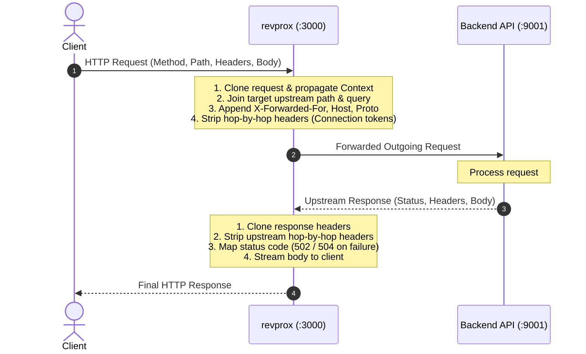

# revprox

A lightweight, robust, and zero-dependency HTTP reverse proxy implemented from scratch in Go using only standard library primitives (`net/http`, `net/url`, `net`, `io`, `time`).

`revprox` demonstrates how core reverse proxy mechanics—such as RFC-compliant hop-by-hop header filtering, `X-Forwarded-*` header handling, context propagation, streaming body transfer, and server timeout hardening—work under the hood without relying on black-box frameworks or `httputil.ReverseProxy`.

---

## Architecture Overview



---

## Features

- **Zero External Dependencies**: Built entirely with Go's standard library.
- **Hop-by-Hop Header Sanitization (RFC 7230 §6.1)**:
  - Dynamically extracts and removes headers specified inside the client's or upstream's `Connection` header before stripping `Connection` itself.
  - Removes default hop-by-hop headers:
    - `Transfer-Encoding`
    - `Upgrade`
    - `Proxy-Authorization`
    - `Trailer`
    - `Te`
    - `Proxy-Authenticate`
    - `Keep-Alive`
    - `Connection`
  - Sanitizes both outbound requests to the upstream server and incoming responses forwarded back to the client.
- **Header Forwarding (`X-Forwarded-*`)**:
  - `X-Forwarded-For`: Appends the client IP (extracted cleanly using `net.SplitHostPort`), preserving any existing proxy chains.
  - `X-Forwarded-Host`: Preserves the original `Host` sent by the client.
  - `X-Forwarded-Proto`: Indicates protocol scheme (`http` or `https` depending on client TLS state).
- **Context & Stream Handling**:
  - Outgoing upstream requests wrap the incoming `r.Context()`, so cancellations or client disconnects immediately propagate upstream.
  - Streaming I/O via `io.Copy(w, resp.Body)` avoids loading entire payloads into memory.
  - Query parameters and nested paths are joined accurately with `singleJoiningSlash`.
- **Server & Transport Hardening**:
  - Custom `http.Transport` with a 5-second `ResponseHeaderTimeout`.
  - HTTP Server timeouts configured to prevent slow-client resource exhaustion and Slowloris attacks:
    - `ReadHeaderTimeout`: 3 seconds
    - `ReadTimeout`: 10 seconds
    - `WriteTimeout`: 15 seconds
    - `IdleTimeout`: 60 seconds
- **Gateway Error Handling**:
  - Distinguishes network timeouts (`504 Gateway Timeout`) from connection refusals or network errors (`502 Bad Gateway`).
- **Built-in Mock Backend**:
  - Comes with a companion test backend in `server/` featuring `/api/ping` and `/api/echo` endpoints for end-to-end verification.

---

## Directory Structure

```text
revprox/
├── main.go         # Core reverse proxy implementation and server entrypoint
├── go.mod          # Go module declaration (github.com/boldbug1/revprox)
├── server/         # Sample backend service for local testing
│   ├── main.go     # Backend test server with /api/ping and /api/echo
│   └── go.mod      # Backend module declaration (temp-server)
└── README.md       # Project documentation
```

---

## Getting Started

### Prerequisites

- [Go](https://go.dev/dl/) 1.22+ (tested with Go 1.26+)

### 1. Start the Mock Backend Server

The test backend listens on `http://127.0.0.1:9001`:

```powershell
cd server
go run main.go
```

Output:
```text
Starting hidden backend on http://127.0.0.1:9001
```

### 2. Start the Reverse Proxy

In a separate terminal, launch `revprox` from the root directory (listens on `:3000` and forwards to `http://127.0.0.1:9001/api/`):

```powershell
go run main.go
```

Output:
```text
proxy listening on :3000, forwarding to http://127.0.0.1:9001/api/
proxy listening on :3000
```

### 3. Verify with `curl`

#### Ping Test
Send a request to `revprox` at `http://localhost:3000/ping`, which forwards to `http://127.0.0.1:9001/api/ping`:

```bash
curl -i http://localhost:3000/ping
```

Expected Response:
```http
HTTP/1.1 200 OK
Content-Type: application/json
Date: ...
Content-Length: 18

"{message: pong}"
```

#### Echo & Header Sanitization Test
Send custom hop-by-hop and client headers:

```bash
curl -i -X POST http://localhost:3000/echo \
  -H "Connection: close, X-Custom-Hop" \
  -H "X-Custom-Hop: should-be-stripped" \
  -H "Keep-Alive: timeout=10" \
  -d "hello reverse proxy"
```

Observe that:
1. `X-Custom-Hop`, `Keep-Alive`, and `Connection` are stripped before hitting the upstream server.
2. `X-Forwarded-For`, `X-Forwarded-Host`, and `X-Forwarded-Proto` are automatically attached.
3. The upstream server's own `Keep-Alive: timeout=5` header is stripped before delivering the response back to your client.

#### Server-Sent Events (SSE) Streaming Test
Test real-time unbuffered event streaming through the proxy:

```bash
curl -N http://localhost:3000/stream
```

Observe that:
1. Events stream immediately every 1 second without buffering delays.
2. Disconnecting the client (e.g. `Ctrl+C`) immediately propagates cancellation upstream to terminate the backend stream goroutine.
3. The proxy resets the write deadline via `http.ResponseController`, ensuring long-lived streams are not terminated prematurely by `WriteTimeout`.

---

## Configuration

Default configurations can be adjusted in [main.go](file:///c:/Users/ANKUSH/Documents/Codes/revprox/main.go):

| Variable / Setting | Default Value | Description |
| :--- | :--- | :--- |
| `port` | `:3000` | Port `revprox` listens on |
| `addr` | `http://127.0.0.1:9001/api/` | Target upstream URL prefix |
| `ResponseHeaderTimeout` | `5 * time.Second` | Max duration waiting for upstream response headers |
| `ReadHeaderTimeout` | `3 * time.Second` | Max time allowed to read request headers |
| `ReadTimeout` | `10 * time.Second` | Max time to read the entire request |
| `WriteTimeout` | `15 * time.Second` | Max time to write the response |
| `IdleTimeout` | `60 * time.Second` | Max time to keep idle connections open |

---

## License

This project is licensed under the MIT License. Feel free to use, modify, and distribute.
